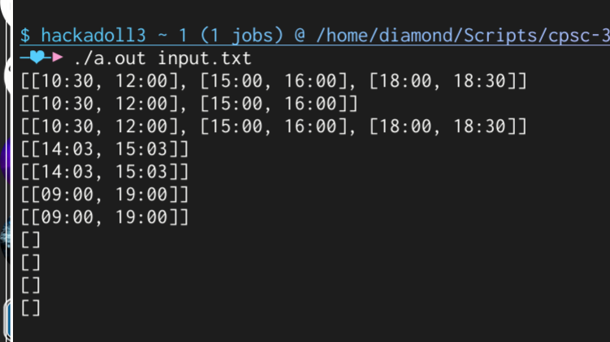

# CPSC 335 -- Project 1

- Name: Diamond Dinh
- Email: diamondburned@csu.fullerton.edu
- Repository: https://github.com/diamondburned/cpsc-335-project1

> **Note:** The solution is implemented in `problem_solve.cpp`.

## Build

```sh
make
```

## Run

```sh
./a.out input.txt > output.txt
```

The output should look like this (with the first output being the example one):



## Proof

Define the following structures:

```py
class TimeSlot:
    startTime: int # minimum 0, maximum 1440
    endTime: int   # minimum 0, maximum 1440

class Person:
    busySchedule: List[TimeSlot]
    workHours: TimeSlot
```

Define the following variables:

```py
people: List[Person]
meetingDuration: int # minimum 0, maximum 1440
```

It is worth mentioning that the `startTime` and `endTime` will never be
greater than 1440, since there are only 1440 minutes in a day.

Let:

- $n$ be the number of people,
- $m$ be the number of busy times per person, and
- $d$ be the number of minutes in a day (24 * 60).

First, we will prove that $d$ is a constant. Since $d$ is the number of minutes
in a day, it is always 1440. Therefore, $d$ is a constant equal to 1440.

Next, we will prove that $m$ is also a constant. No time slots in $m$ can
overlap. $m$ is also limited to the working hours of a person. Since the
working hours of a person is always less than or equal to $d$, $m$ is always
less than or equal to $d$. Therefore, $m$ is a constant.

Note that `generate_worstcase` generates a worst case scenario where $m = d$
with no overlap. This proves the worst case scenario of $m$.

Finally, we will prove that $n$ is not a constant. Since $n$ is the number of
people given in the input, it can be any number. Therefore, $n$ is not a
constant.

We can then implement the algorithm as follows:

```py
# 4 steps
minutesPerDay = 24 * 60
busyMinutes = [False] * minutesPerDay
latestStartTime = 0
earliestEndTime = minutesPerDay

# n*inner steps
for person in people:
    # 2 steps
    latestStartTime = max(latestStartTime, person.workHours.startTime)
    earliestEndTime = min(earliestEndTime, person.workHours.endTime)
    # m*inner steps
    for busyTime in person.busySchedule:
        # d*inner steps
        for minute in range(busyTime.startTime, busyTime.endTime):
            # 1 step
            busyMinutes[minute] = True
        # d*1 steps
        # d steps
    # 2 + m*d steps
# n*(2 + m*d) steps

# 1 step
freeTimes = []

# 1 step
start = None
# d*inner steps
for minute in range(latestStartTime, earliestEndTime + 1):
    # 2 steps + max(inner1, inner2) steps
    if minute < earliestEndTime and not busyMinutes[minute]:
        # 1 step
        if start is None:
            # 1 step
            start = minute
        # 2 steps
    else:
        # 2 steps
        if start is not None and (minute - start) >= meetingDuration:
            # 1 step
            freeTimes.append((start, minute))
            # 1 step
            start = None
        # 4 steps
    # 2 + max(4, 1) steps
    # 2 + 4 steps
    # 6 steps
# d*6 steps

return freeTimes
```

Note that `for range(busyTime.startTime, busyTime.endTime)` can be rewritten
to the following:

```py
for minute in range(0, 1440):
    if minute < busyTime.startTime or minute >= busyTime.endTime:
        continue
    # ...
```

Which would make the loop run for 1440 times, showing that the loop runs in
$\text{O}(d)$ time rather than a variable amount of time.

Adding up the steps, we get:

$$
\begin{aligned}
  & \ 4 + n * (2 + (m * d)) + 1 + 1 + (d * 6) \\
= & \ 6 + n * (2 + (m * d)) + (d * 6) \\
= & \ 6 + 2n + (n * m * d) + (d * 6) \\
= & \ 6 + 2n + (n * m * 1440) + (1440 * 6) \ \text{  (assume $d$ is a constant)} \\
= & \ 6 + 2n + (n * m * 1440) + 8640 \\
= & \ 8646 + 2n + 1440nm \\
= & \ 8646 + 2n + 1440^2 n \text{  (assume $m$ is a constant)} \\
= & \ 8646 + 2n + 2073600n \\
= & \ 8646 + 2073602n \\
\end{aligned}
$$

Given the above step count of the algorithm, we arrive at 2 different possible
conclusions:

- If we consider $m$ to be a constant (due to a known maximum value), the
  algorithm runs in $\text{O}(n)$ time.
- If we consider $m$ to be a variable, the algorithm runs in $\text{O}(n^2)$
  time.

Note that $d$ is considered a constant in both cases, since it is a constant
value of 1440.
